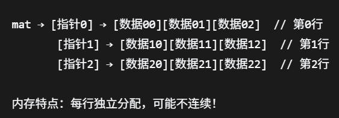
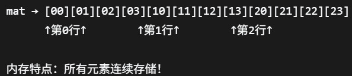

# <mark>C++应用</mark>

---


## <mark>随机数生成</mark>

传统C方法：

```c++
#include<cstdlib>
#include<ctime>
//初始化随机种子(只需一次)
srand(time(0));
int random_num = rand();
int random_inrange = rand()%100;//0-99
int random_inrange = rand()%100+1//1-100 
//随机质量不怎么高，易预测，不均匀
```

现代C++方法：

```c++
#include<random>

```

---


## <mark>关于std::</mark>

由于平时写算法题都用头文件：

`#include<bits/stdc++.h>`+`using namespace std;`

容易忽略了`std::`的使用;

```c++
std::工具名-->使用std仓库的某个工具
using namespace std-->默认从std使用工具
//实际工作时,不推荐使用上述头文件
//输入输出，字符串string，容器，算法函数等都需要加std::
std::cout<<"minecraft";
std::endl;
std::vector<int> a;std::map<std::string,int> mp;
std::string s = "hello";
std::sort(a,a+n);
std::swap(a,b);
std::max(x,y);std::min(x,y);
```

也可以只引入常用的几个：

```c++
using std::cout;
using std::cin;
using std::vector;
using std::endl;
//其他仍要加上std::
```

---


## <mark>矩阵乘法优化</mark>

```c++
int n,m,s;
cin>>n>>m>>s;//表示是n*m与m*s的矩阵相乘
//原始数学算法
for(int i = 0;i<n;i++){
    for(int j = 0;j<s;j++){
        for(int k = 0;k<m;k++){
            c[i][j] += a[i][k]*b[k][j];
        }
    }
}
fill(c.begin(),c.end(),vector<int>(s,0));
//下面是效率更高的算法，先当黑盒用
for(int i = 0;i<n;i++){
    for(int k = 0;k<m;k++){
        for(int j = 0;j<s;j++){
            c[i][j] += a[i][k]*b[k][j];
        }
    }
}
//其实就是把基础版本的后两个for循环换了一下位置。
```

---

## <mark>new/delete动态内存</mark>

相比`C的malloc函数`更加安全可用一些;

用于申请动态内存，创建变量

```c++
//单变量创建
int *p = new int;
*p = 10;//赋值
delete p;//释放内存method1

//数组变量创建
int size;
cin>>size;//用户输入数组大小
int *arr = new int[size];//动态分配
for(int i = 0;i<size;i++){
    arr[i] = i;//赋值
    //或者*(arr+i) = i;  
}
delete[] arr;//释放内存method2

//二维数组
int *arr = new int[row*col];

//其他写法
int *p = new int();//初始化为0
int *p = new int(1);//初始化为1
int *arr = new int[5]();//初始化全为0
int *arr = new int[5]{1,2,3};//前三个初始化，后两个为0
```


---

## <mark>vector底层指针数组</mark>

虽然已经会用`vector<>`这种自动化的工具，但是:

`int **mat`和`int *mat`也是要掌握的 ;

以便了解`vector<>`的底层原理；

```c++
//传统方法
int row,col;
cin>>row>>col;//输入矩阵大小
int **mat = new int*[row];//每个mat元素指向一个int*的指针
for(int i = 0;i<row;i++){
    mat[i] = new int[col];//每个mat[i]指向一个int的数组
}
for(int i = 0;i<row;i++){
    for(int j = 0;j<col;j++){
        mat[i][j] = i*col+j;//赋值就是老方法    
    }
}
for(int i = 0;i<row;i++){
    delete[] mat[i];//先释放每一行
}
delete[] mat;//再释放行指针数组
```

解引用：

`mat[i][j]=*(*(mat+i)+j)`



应用场景：

```c++
//创建不规则稀疏矩阵
int **jagged = new int*[3];
jagged[0] = new int[2]{1,2};
jagged[1] = new int[3]{3,4,5};
jagged[2] = new int[1]{6};
//频繁交换行
void row_swap(int **mat,int row1,int row2){
    int *tmp = mamt[row1];
    mat[row1] = mat[row2];
    mat[row2] = tmp;
}
//...
```


```c++
//内存连续存储方法
//性能更高
int row = 3;int col = 4;
int *mat = new int[row*col];
for(int i = 0;i<row;i++){
    for(int j = 0;j<col;j++){
        mat[i*col+j] = i*col+j;//赋值    
    }
}
delete[] mat;//释放内存
```




---


