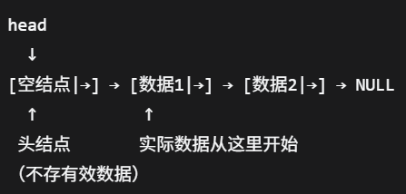

# <mark>数据结构</mark>

---


## <mark>语法</mark>

---


### <mark>Class类</mark>

类似于`Struct`结构体的升级拓展版，先初步了解一下`Class`的基本语法吧.

用于**操作和数据**的封装，**面向对象**

大部分情况，Class内部只包含`**数据和函数**`

能够把近似的数据和函数归类整理，有助于避免屎山代码

Class内部可以再嵌套另一个Class，这里不展开

```c++
class 类名称{
private://以下内容私有，只有class内部可以调用和访问
    //这里暂时不讨论private，只以public为例
    string password;//比如密码私有
public://以下内容公开，class内外都可以调用和访问
    int age;
    string name;//属性，数据
    void print(){//普通函数
        cout<<age<<" "<<name<<endl;//用于做具体操作
    }
    类名称(int nianling,string xingming){//构造函数
        //函数名称必须与类名称一样，不需要写返还的类型
        //用于创造东西
        age = nianling;
        name = xingming;
    }
    类名称(){
        age = 0;
        name = "";
    }
};//别漏分号


int main(){
    //Class的类名称即是一个自定义的变量类型
    //可以自行在main中调用
    类名称 pastman;//无构造函数的初始化
    pastman.age = 18;
    pastman.name = "hth";
    //调用构造函数创建对象
    类名称 deadman(18,"hth");
    //利用class创建了一个自定义类型的变量，同时调用构造函数进行了初始化
    return 0;
}
```

---

### <mark>动态链表</mark>

一般都是**推荐带上头结点**的：

以几个字节存储空间的代价换来后面插入删除等逻辑的统一


<mark>前插入法：</mark>

(前插入法的结果会使数据与写入顺序相反)

**每次的newnode要先后处理它的头和尾，也就是这个newnode的next要指向哪？又有谁的next指向这个newnode？**

`newnode->next = head->next;//`

`head->next = newnode;//`

(两行代码顺序不能换)

```c++
#include<bits/stdc++.h>
using namespace std;
struct node{//结点
    int data;
    node *next;
}
node *createlist(){//链表创建
    node *head = new int();//创建头结点
    head->next = NULL;
    while(1){
        int value;
        cin>>value;
        if(value<=0)break;
        node *newnode = new node();//创建新结点
        newnode->data = value;//先把数据域处理掉
        newnode->next = head->next;//处理新结点的头
        head->next = newnode;//处理新结点的尾
    }
    return head;//返回头结点
}
```



<mark>尾插入法：</mark>

```c++
#include<bits/stdc++.h>
using namespace std;
struct node{
    int data;
    node *next;
}
node *createlist(){
    node *head = new node();//创建头结点
    head->next = NULL;
    node *tail = head;//需要再创建一个尾结点
    while(1){
        int value;
        cin>>value;
        if(value<=0)break;
        node *newnode = new node();
        newnode->data = value;//老样子先处理数据
        tail->next = newnode;//处理newnode的尾
        tail = newnode;//移动到newnode上
        tail->next = NULL;//处理newnode的头
    }
    return head;
}
```

这里只包括链表基本创建，还有链表打印，查找，插入，删除，以及内存释放，待学习

---

## <mark>算法</mark>

---


---
