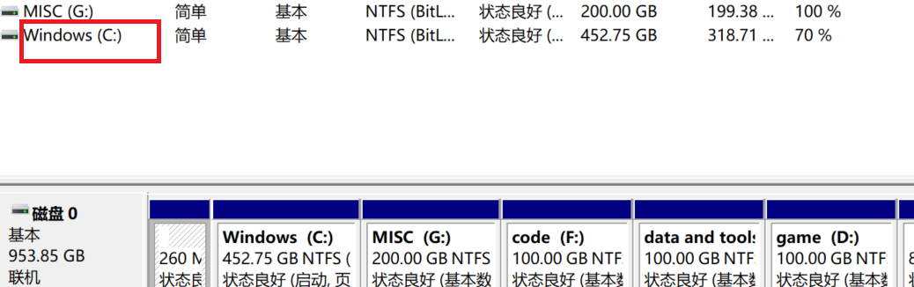

# ==Clash_verge==

> windows代理软件

## 下载使用

直接浏览器搜索引擎搜索,或者去github上搜索都可以下载;
（如果打不开github可以下载watt加速器加速github）
(`Clashverge`的github主页也有很多机场的推荐)
## 可能的问题

- Wrong1:若刷新ip信息显示`"所有ip检测服务失败:undefined"`;但是节点正常,只不过流量上传和下载始终是0,无法使用;

可能就是系统把端口预留了,比如一开始端口是`7897`,

修改`代理软件`和`系统代理端口`重试,比如改成`10808`等;

---

# ==Shadowrocket==

> ios代理软件

首先需要给`Appstore`注册一个美区账号

然后才能在商店购买正版Shadowrocket

或者使用网上的`共享账号登录App Store`（千万别登录系统账号）
搜索shadowrocket进行下载后 登录回自己的账号

## 注册美区账号

参考教程：[[https://www.bilibili.com/video/BV1zHtmzDEVY/?spm_id_from=333.337.search-card.all.click&vd_source=04d755a57294157b6417db0ec31c1460]]
（我用Google创建了新的美区账号一样可以）

---

# ==OBS==

> 录屏直播软件

## 游戏录制

- 推荐选择添加`窗口采集`源,比`游戏采集`源更加稳定;

- 在设置中打开`回放缓存`:

可以在精彩内容出现后按下快捷键保存前几十秒的游戏内容

- 在设置中调整`视频编码器`:

选择最好的编码器,尽量避免录屏时游戏卡顿

- 在设置中调整`分辨率`:

`基础分辨率`必须和设备一样,如果卡顿可以适当`降低输出分辨率`

如果后期发现没有录制整个游戏屏幕,在主界面依次点击

`编辑-变换-比例适配屏幕`可能能解决问题

---

# ==Ollama==

> 管理本地大模型
> 目前更喜欢用`LM Studio`

## 安装Ollama

[Download Ollama on Windows](https://ollama.com/download/windows)

[Download Ollama on Linux](https://ollama.com/download/linux)

[Download Ollama on macOS](https://ollama.com/download/mac)

不开梯子下载会很慢,暂时没有梯子可以选择复制上面链接后,

进入minecraft启动器PCL2进行多线程下载;

---

# ==Windows==

> 记录一些系统设置操作

## 分盘

(分盘时最好给C盘预留至少100G的空间)

`win+x`-`磁盘管理`-右键`windows(C盘)`;

点击`压缩卷`,稍作等待,修改要分出去的存储空间大小;

例如分出去100G 就修改为`102400`(MB);

后续配置无需修改 一直点`下一步`即可;

最后再右键`未分配`的区域进行分配即可;

## 浏览器

### 关闭最后标签页但不关闭浏览器

- edge
右键桌面edge图标-属性
在目标一栏的最后加上` --enable-features=msSpawnNtpOnLastTabClose`
再次进入edge测试即可
- firefox
在浏览器地址栏输入`about:config`
搜索`browser.tabs.closeWindowWithLastTab`
改为`false`即可

---
