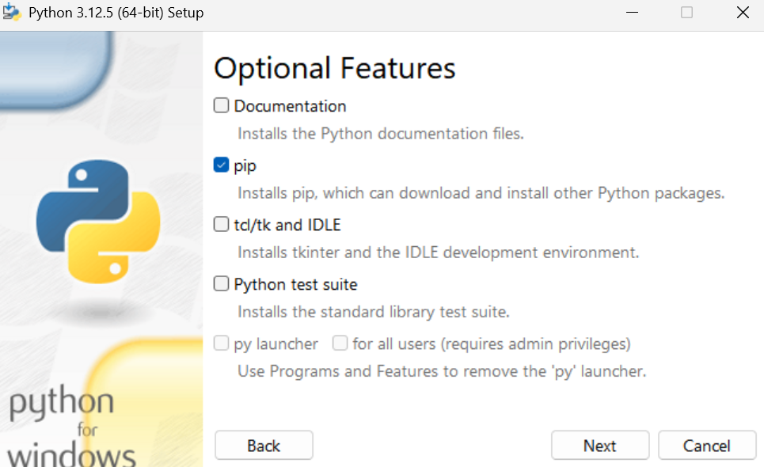
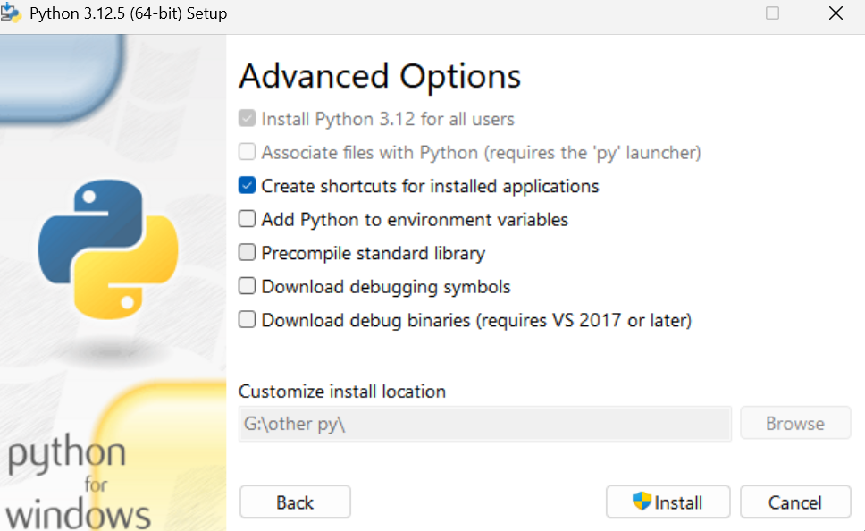

直接扩展商店里搜索`python`-安装microsoft官方插件即可；

---

# 基础版本管理

- Python多版本:
系统已经将py3.14安装并写进系统PATH，但是flask目前更适合3.10-3.12的python
因此再去官网安装python3.12 此时注意几点:

1.不要再添加进系统环境变量
2.参考的安装选项:

(只需要pip就行了 其他都是多余的 因为已经安装过3.14的py)

(推荐给所有用户安装 其后按照图示配置即可)


- 之后创建项目:
可以先检查py的安装
```bash
py -0
```
应该会输出3.14和3.12两个py版本

然后创建并激活虚拟环境venv
```bash
py -3.12 -m venv .venv
.venv\Scripts\Activate.ps1
```
最后`pip install flask`


---
# py开发

(示例)可用结构
```text
myproject/
├── pyproject.toml
├── README.md
├── LICENSE
├── .gitignore
├── tests/     #用于pytest测试
│   └── test_xxx.py
└── src/       #项目核心源码
    └── myproject/
        ├── __init__.py    #必须
        ├── main.py
        └── utils.py
```

首先创建`pyproject.toml`:(示例)
```toml
[build-system]
requires = ["setuptools>=61"]
build-backend = "setuptools.build_meta"

[project]
name = "myproject"
version = "0.1.0"
description = "Example project"
readme = "README.md"
requires-python = ">=3.11"

dependencies = [
    "requests>=2.32",
    "rich>=14.0"
]

[project.optional-dependencies]
dev = [
    "pytest",
    "ruff"
]

[tool.setuptools.packages.find]
where = ["src"]

[tool.ruff]
line-length = 88
```

然后运行以下命令:(前提是已有pyproject.toml和__init__.py)
```bash
pip install -e ".[dev]"
```
Python会将当前项目以`Editable模式安装到当前虚拟环境中`
之后修改`/src`中的代码会立即生效 无需重新执行pip install
基础测试:
```bash
pytest #运行/tests中的自动化测试 检查功能有没有坏
ruff check . --fix #检查代码有没有明显问题
ruff format . #统一代码格式
```

`pip install -e ".[dev]"`之后无论在哪个目录都可以通过
```python
import myprojext
from myproject import main #等等
```
来直接读取使用项目的代码

最后构建包
```bash
python -m build
```
会生成`dist/`文件 供本地安装或上传到PyPI

发布包到PyPI
```bash
twine upload dist/*
```

---

# 可能的问题
- Powershell脚本权限
windows的powershell默认没有执行脚本权限 导致无法自动激活虚拟环境 可以通过执行(管理员)
```powershell
Set-ExecutionPolicy -Scope CurrentUser RemoteSigned 
```
然后选择“Y”来激活权限-从而顺利地使用venv虚拟环境

同时可以通过(管理员)
```powershell
Set-ExecutionPolicy -Scope CurrentUser Undefined
```
来还原Powershell设置