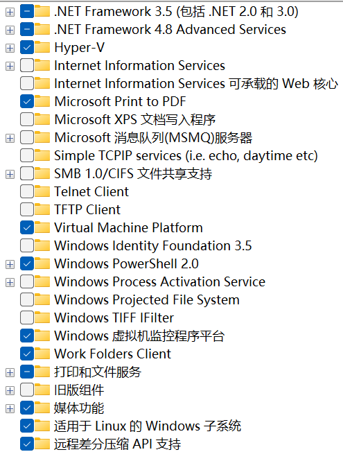
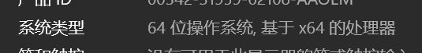
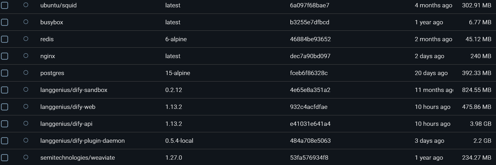
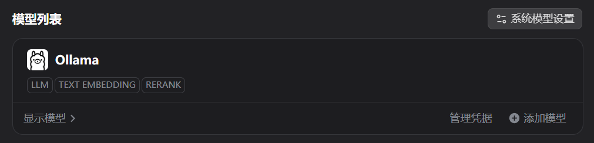
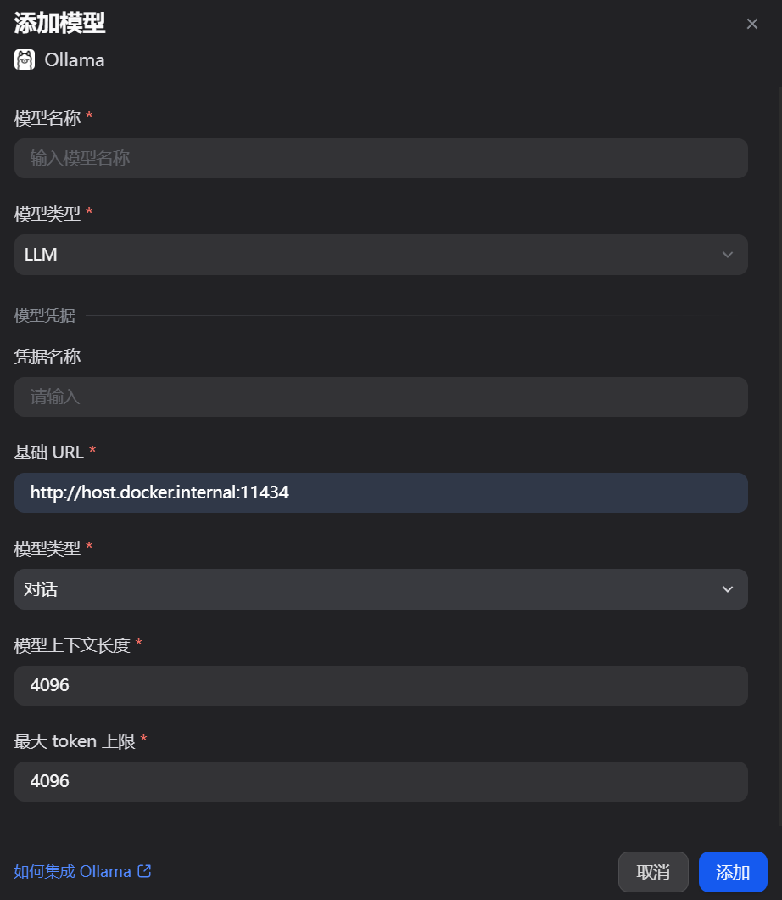

# <mark>安装配置Docker</mark>

> windows

---


- 首先安装最新版本的WSL2

win键搜索`启用或关闭windows功能`;

(以下是win11家庭版 如果有"虚拟机平台" 也勾选上)



安装Hyper-V

新建文本文件-打开-将以下内容复制进去-保存退出-

将文本文件后缀改为`cmd`-右键管理员身份运行-安装完后重启计算机

```batch
pushd "%~dp0"
dir /b %SystemRoot%\servicing\Packages\*Hyper-V*.mum >hyper-v.txt
for /f %%i in ('findstr /i . hyper-v.txt 2^>nul') do dism /online /norestart /add-package:"%SystemRoot%\servicing\Packages\%%i"
del hyper-v.txt
Dism /online /enable-feature /featurename:Microsoft-Hyper-V -All /LimitAccess /ALL
pausepause
```

win键搜索`powershell`-右键管理员身份打开-输入`wsl --install --no-distribution`;(安装不带任何发行版的Linux虚拟机);

后续查看版本输入:

`wsl --list --verbose`;

安装Ubuntu:

`wsl --install Ubuntu-22.04`;

最后换原:

```bash
sudo su
bash <(curl -sSL https://linuxmirrors.cn/main.sh)
```

(这样基本能装好wsl2 剩余内容待更新)

---


- 根据系统信息选择docker安装包

win键打开设置-系统-系统信息:



如果跟图示一样就选择`AMD64`的docker安装包;(大部分都是这个)

否则选择下载`ARM64`的安装包;

双击下载好的安装包-安装过程中如果有提示 选择WSL

其他问题可以访问[Docker Docs](https://docs.docker.com/)解决

---


- Docker配置：

右上角设置-Resources-可以修改`Disk image location`(C盘空间足够的话可以不修改);

设置-`Docker Engine`:

```json
{
  "builder": {
    "gc": {
      "defaultKeepStorage": "20GB",
      "enabled": true
    }
  },
  "experimental": false,
  "features": {
    "buildkit": true
  },
  "registry-mirrors": [
    "https://docker.m.daocloud.io",
    "https://docker.nju.edu.cn",
    "https://docker.mirrors.ustc.edu.cn",
    "https://hub-mirror.c.163.com",
    "https://mirror.baidubce.com",
    "https://mirror.aliyuncs.com",
    "https://docker.mirrors.sjtug.sjtu.edu.cn",
    "https://dockerproxy.com",
    "https://dockerhub.icu",
    "https://mirror.iscas.ac.cn",
    "https://docker.rainbond.cc"
  ]
}
```

---


# <mark>部署Dify</mark>

- 在想要存放dify文件夹的目录右键打开终端;

网络不好的话就修改一下git配置如下:(需要先装好git)

选择浅克隆;(即不包含历史提交文件 只有最新文件)

```bash
git config --global http.postBuffer 524288000
git config --global core.compression 9
git clone --depth 1 https://github.com/langgenius/dify.git
```

等待下载完毕

- 打开dify文件夹/Docker/.env.example

将`.env.example`重命名为`.env`;

(目的是让dokcer能够读取配置文件)

在当前Docker文件夹打开终端运行:

```bash
docker compose up -d#启动dify容器
```

此时由于还没有拉取(pull)相关镜像 会先进行拉取;

如果中途失败多半是网络问题;

可以再次输入上述命令重试 直到全部下载完成;

更推荐的则是逐条镜像拉取(按照大小从小到大逐个pull);



全部拉取完成后能在docker-images中看到以上镜像;(版本仅供参考)

- 打开DIfy网页

确保镜像全部拉取完毕 并且docker处于后台运行状态下;

选择用`docker compose up -d`启动dify;

然后浏览器URL输入`http://localhost/signin`;

就能进入dify页面了 初次进入需要注册;

- 连接本地ollama大模型

进入页面后点击右上角头像-设置;

左侧栏-模型供应商-选择安装ollama供应商;



安装完成后点击上图右下角-添加模型;



模型名称填写-本地已部署的大模型名称(需完全一样);

模型类型-LLM;

基础URL-`http://host.docker.internal:11434`;

其他可以暂时保持默认 然后点击添加 就可以用了;

可以在工作区创建一个`聊天助手`类型的空白应用进行测试;

- 关闭dify以及docker

在`dify/docker`目录下的终端输入`docker compose down`(会停止并删除容器 但会保留数据和配置)

后可再输入`docker ps`;若只输出表头 说明容器都已经关闭;

然后右下角退出docker就好了(`Quit Docker Desktop`);


