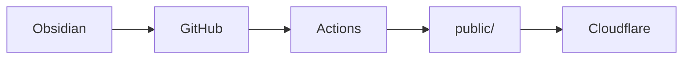

> 这一篇是"测试样章"，**不是教程**。
> 它存在的意义是：看一眼长什么样 — 文字 / 标题 / 列表 / 表格 / 代码 / 图 / 折叠 / 公式 / 链接 ……
> 改样式时优先对照这一篇。

## 1. 文字

普通文字，**粗体**，*斜体*，~~删除线~~，`inline code`，[内链](/notes/)，[外链](https://gohugo.io/)。

行内公式：$E = mc^2$。

按 <kbd>Ctrl</kbd> + <kbd>K</kbd> 搜索。

这是 ==高亮文字== (mark)。

下面是脚注示例[^1]。

## 2. 标题层级

### 2.1 三级标题
#### 2.2 四级标题
##### 2.3 五级标题

## 3. 列表

**无序：**
- 第一项
- 第二项
  - 嵌套 A
  - 嵌套 B
    - 再嵌一层
- 第三项

**有序：**
1. 第一步
2. 第二步
3. 第三步

**任务列表：**
- [x] 已完成
- [ ] 待办 1
- [ ] 待办 2

**定义列表：**

Hugo
: 静态网站生成器

Blowfish
: 一个 Hugo 主题

## 4. 引用

> 一段引用文字。
> 可以多行。
>
> —— 某个人

## 5. 表格

| 模块 | 状态 | 路径 |
|---|---|---|
| notes | OK | `/notes/` |
| works | TBD | `/works/` |
| life | TBD | `/life/` |
| about | TBD | `/about/` |

## 6. 代码块

**Go：**

```go
package main

import "fmt"

func main() {
    fmt.Println("Hello, Hugo!")
}
```

**Python：**

```python
def fib(n: int) -> int:
    a, b = 0, 1
    for _ in range(n):
        a, b = b, a + b
    return a
```

**Bash：**

```bash
hugo --minify --themesDir themes --theme blowfish
```

**JavaScript：**

```javascript
const greet = (name) => `Hi, ${name}!`;
console.log(greet('lyrumu'));
```

## 7. 流程图



## 8. 提示框（用 blockquote + emoji）

> ℹ️ **INFO**  普通信息提示。

> ⚠️ **WARNING**  注意事项 / 警告。

> ✅ **DONE**  完成事项。

> 💡 **TIP**  小贴士。

## 9. 链接与下载

- [示例 zip](https://example.com/sample.zip) （占位）
- [示例 mp3](https://example.com/sample.mp3) （占位）

[GitHub 仓库](https://github.com/)

## 10. 图片


## 11. 折叠

<details>
<summary>点击展开</summary>

里面什么都能放。

```python
print("hello")
```

</details>

## 12. Emoji

:joy: 直接出，或者字符 🎉。

## 13. 数学公式

行内：$a^2 + b^2 = c^2$

块级：

$$
\int_{0}^{\infty} e^{-x^2} dx = \frac{\sqrt{\pi}}{2}
$$

## 14. 测试清单

- [x] 文字（粗 / 斜 / 删 / 内联码 / 内链 / 外链）
- [x] 脚注
- [x] 标题层级
- [x] 列表（无序/有序/任务/嵌套/定义）
- [x] 引用 / 提示框
- [x] 表格
- [x] 代码块（多语言）
- [x] Mermaid
- [x] 链接与下载
- [x] 图片
- [x] details 折叠
- [x] kbd / mark / Emoji
- [x] 公式（行内 / 块级）
- [x] Tag / Category / Series
- [x] Hero 背景 / 面包屑 / TOC / 相关文章

[^1]: 对，就是这条。